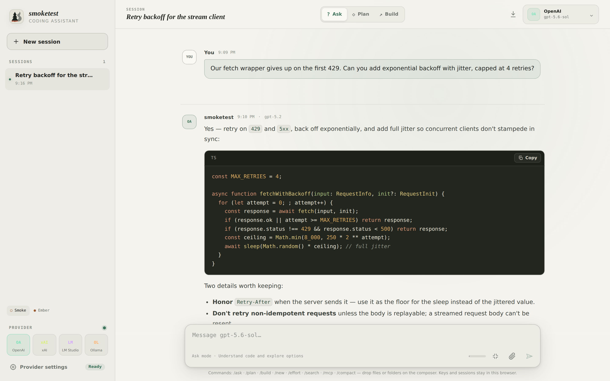
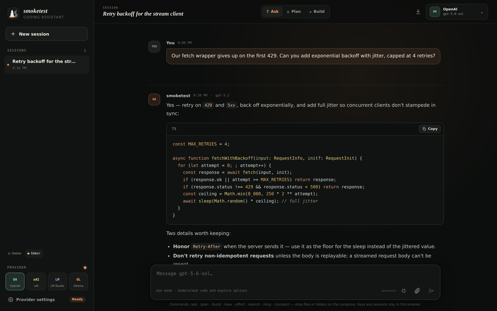
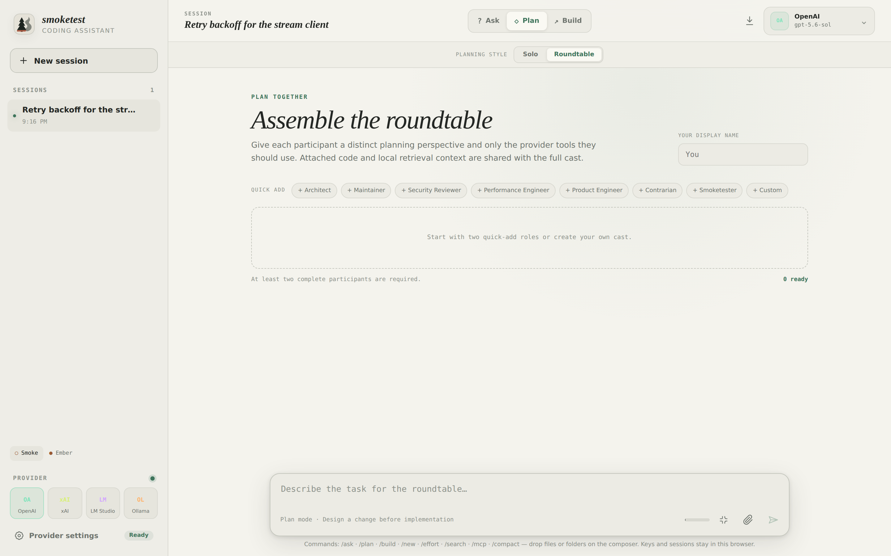

# smoketest

<picture>
  <source media="(prefers-color-scheme: dark)" srcset="./public/logo-dark.svg">
  <source media="(prefers-color-scheme: light)" srcset="./public/logo-light.svg">
  
</picture>

A focused, cross-provider coding assistant built around one protocol: the OpenAI Responses API.

> [!IMPORTANT]
> **Work in progress.** smoketest has received basic happy-path testing and the implemented features appear to work as intended, but it is still early software. Expect rough edges, provider API drift, and incomplete workflows. This is a small Responses API workbench—not a replacement for a mature coding agent such as Claude Code.

smoketest supports four Responses API-compatible targets:

- **OpenAI** — `https://api.openai.com/v1/responses`
- **xAI** — `https://api.x.ai/v1/responses`
- **LM Studio** — `http://127.0.0.1:1234/v1/responses`
- **Ollama** — `http://127.0.0.1:11434/v1/responses`

There are no Chat Completions adapters and no provider SDKs. The app sends the same minimal Responses request shape to every provider and consumes standard Responses streaming events.

## Screenshots

Conversation view in the Smoke (light) theme:



The same session in the Ember (dark) theme:



Roundtable planning, where several model participants plan a change together:



## Features

- Ask, Plan, and Build coding modes
- Streaming Responses API output
- FIFO follow-up message queue while a response is streaming
- Switch providers while keeping the conversation transcript, making it possible to plan with one model and execute with another
- History sent to the provider is windowed to a token budget (larger for cloud providers, smaller for local models) so long threads don't grow the request payload without bound
- File and directory attachments as inline context, with browser-side parsing and local retrieval for larger document sets
- OpenAI and xAI provider tools, including web search, Code Interpreter, file search, and remote MCP; xAI also exposes X search
- Download buttons for provider-generated Code Interpreter files when the response contains usable file metadata
- OpenAI **Fast mode**, which sends Priority processing (`service_tier: "priority"`) when enabled
- Browser-local sessions, API keys, models, and preferences
- Provider model discovery through `GET /v1/models`
- Fixed provider endpoints to avoid arbitrary server-side request routing
- Responsive desktop and mobile workspace
- Smoke light theme and Ember dark theme
- Request cancellation and provider-aware error handling
- Optional local memory: the assistant can remember/forget short user details on request, stored only in the browser and folded into future system prompts
- Optional skills: upload `SKILL.md` instruction packages the assistant loads on demand via a tool call, keeping the system prompt to just a name and description until one matches — or force-load one yourself with `/skill <name>` when auto-trigger doesn't fire
- Optional Electron desktop app (Linux AppImage, Windows installer, macOS dmg)

## Run in Google Colab

[](https://colab.research.google.com/github/h1ddenpr0cess20/smoketest/blob/master/colab/smoketest_colab.ipynb)

[`colab/smoketest_colab.ipynb`](colab/smoketest_colab.ipynb) builds smoketest in a Colab VM, launches it as a production server, and embeds it right in the notebook via Colab's own authenticated port-proxying — no local setup, no public link needed. An optional step also opens a temporary public URL (a Cloudflare quick tunnel) for access from another device. It installs LM Studio and, optionally, Ollama in the same VM so those local providers work too, and can download **google/gemma-4-12b-qat** for LM Studio. Read the notebook's caveats before use: only LM Studio/Ollama running in that same VM are reachable — not local providers on your own machine — and the optional tunnel link is public and ephemeral.

## Run locally

Requires Node.js 22 or newer.

```bash
npm install
npm run dev
```

Open [http://localhost:3000](http://localhost:3000), choose a provider, and open **Provider settings**.

For LM Studio, start the local server from the Developer tab. For Ollama, make sure Ollama is running and the model entered in settings is installed.

## Cross-provider planning and execution

A useful experimental workflow is to use xAI or a local model for the **Plan** and/or **Build** stages, then switch the same session to OpenAI for Code Interpreter:

1. Develop the plan or draft with Grok, LM Studio, or Ollama.
2. Open **Provider settings**, switch to OpenAI, and enable **Code interpreter**.
3. Ask OpenAI to follow the plan, run the necessary code, and package the deliverables into a ZIP file.
4. If the response exposes the generated artifact, use its download button.

The transcript is sent again on each turn, so OpenAI can use the earlier plan. Code Interpreter only sees the conversation and files included in the request; it does not gain direct access to your local repository or filesystem. Attach any source material it needs, and explicitly ask it to create and link the ZIP.

## MCP shell access with LM Studio

Another useful workflow: give a local LM Studio model real shell access via MCP, using the [Shell MCP server](https://github.com/h1ddenpr0cess20/mcp/tree/main/shell_mcp) from the [h1ddenpr0cess20/mcp](https://github.com/h1ddenpr0cess20/mcp) collection.

1. From the `mcp` repo, install and run the server: `pip install -r shell_mcp/requirements.txt && python shell_mcp/server.py`. It serves HTTP on `http://127.0.0.1:9610/mcp` and either connects to an existing SSH host or auto-provisions an isolated VirtualBox VM as the sandbox, depending on `shell_mcp/.env`.
2. Start LM Studio's local server (Developer tab) with a tool-capable model loaded.
3. In smoketest, select LM Studio as the provider, open **Provider settings**, and under **MCP servers** add a label (e.g. `shell`) with URL `http://127.0.0.1:9610/mcp`, then enable it. Local providers allow plain `http://` MCP URLs since the server runs alongside smoketest.
4. Ask the model to run commands, read/write files, or pull system info from the sandbox — it calls the server's tools directly, in the same turn, with no separate approval step.

MCP tool calls run with `require_approval: "never"`, so only point this at a server and sandbox you trust. The same repo's `docker_shell_mcp` (Docker-backed, port 9620) and `webshell_mcp` (shell plus web search in one VM, port 9710) follow the same steps if you'd rather sandbox in a container or add web search alongside shell access.

## Generated-file caveats

Generated-file handling is provider-dependent and should be considered experimental.

- OpenAI Code Interpreter output collection and container-file downloads are wired through a same-origin proxy so API keys are not placed in browser-visible download URLs.
- A download button only appears when the provider returns a file ID or container-file citation that smoketest can identify. A model mentioning a filename in prose is not enough.
- Provider files can be temporary and tied to the API account or container that created them. Download important artifacts promptly and keep using the credential that generated them.
- xAI Code Interpreter is sent the smaller tool shape its API expects, avoiding the `non-auto container` error. Code execution may work while downloadable artifact metadata or file endpoints differ from OpenAI; xAI downloads are therefore best-effort.
- LM Studio and Ollama do not expose a compatible provider files API here, so they cannot produce download buttons through this mechanism.
- ZIP creation is performed by the selected model's Code Interpreter, not by smoketest itself. Ask for a ZIP explicitly when you want a single downloadable package.

## OpenAI Fast mode

The OpenAI-only **Fast mode** toggle requests Priority processing by adding `service_tier: "priority"` to send and regenerate requests. It requires eligible OpenAI API access and uses Priority processing pricing. The server ignores this setting for xAI and local providers.

## Privacy and trust boundary

Threads, attached file contents, API keys, and settings are stored in the browser's `localStorage`. Each request sends the selected credential to smoketest's same-origin route, which forwards it to the selected fixed provider endpoint for that request. The app does not persist credentials server-side.

This design makes local providers reachable from the Next.js server running on the same computer. If you deploy smoketest elsewhere, `127.0.0.1` refers to that deployment host—not the visitor's computer—so LM Studio and Ollama should be used with the app running locally.

## Safety and intended use

smoketest is a coding tool. It is **not intended for children** and must not be used as a companion, friend, therapist, or romantic partner. AI output—including generated code—can be inaccurate, insecure, or inappropriate; never rely on smoketest for crisis response, professional advice, or safety-critical decisions. MCP tool calls run without a manual approval step in this UI, so only connect a server you trust.

Read the [AI Output Disclaimer and Conditions of Use](docs/ai-output-disclaimer.md), [Not a Companion](docs/not-a-companion.md), and [Security](docs/security.md) docs before using or deploying the app. The [documentation index](docs/README.md) summarizes these boundaries.

## Quality checks

```bash
npm run check
npm run build
```

The automated suite covers request shaping, streaming event parsing, generated-file metadata and download proxying, document handling, retrieval, exports, and provider helpers. Basic manual smoke testing has also been performed, but the provider matrix has not been exhaustively tested across every model, account tier, tool combination, browser, or deployment topology.

## Docker

```bash
docker build -t smoketest .
docker run --rm -p 3000:3000 smoketest
```

The container exposes a health check at `/api/health`. Remember that local-provider URLs resolve from inside the container; reaching LM Studio or Ollama on the host may require platform-specific host networking or URL changes that smoketest does not currently expose.

## Desktop app

smoketest ships an optional Electron wrapper (`electron/main.cjs`). It runs the same Next.js app as a local server on `127.0.0.1` and loads it in a frameless `BrowserWindow` with a native title-bar overlay — the existing top bar doubles as the window's drag region. All app logic and the browser/local-provider trust boundary described above are unchanged; the desktop shell only adds native integration a browser tab can't provide (downloads saved straight to the OS Downloads folder, external links opened in the system browser, single-instance focus).

```bash
npm run electron        # build and launch the desktop app
npm run electron:run    # relaunch the existing build without rebuilding
```

To package a distributable:

```bash
npm run electron:dist
# -> release/
```

Produces an `AppImage` on Linux, an `nsis` installer on Windows, and a `dmg`/`zip` on macOS, per the `build` config in `package.json`. Platform-specific variants (`electron:dist:linux`, `electron:dist:win`, `electron:dist:mac`) are also available, and are what `.github/workflows/desktop-release.yml` runs to attach installers to a published GitHub release.

## Project origin

smoketest grows out of the author's earlier **wordmark** and **darkwords** projects. After **Grok Build** was open-sourced, its codebase was adapted to that existing work to create **brainworm**, and then the next day, smoketest.

## About the deployment URL

Vercel's auto-generated preview/production URLs for this project happen to include "azure." That's Vercel's naming, not a choice made here, and there's no affiliation with Microsoft. Azure's AI platform could be a fine addition as a provider down the line — and if Microsoft's reading this and wants to acquire a cross-provider Responses API workbench, we're open to the conversation.
